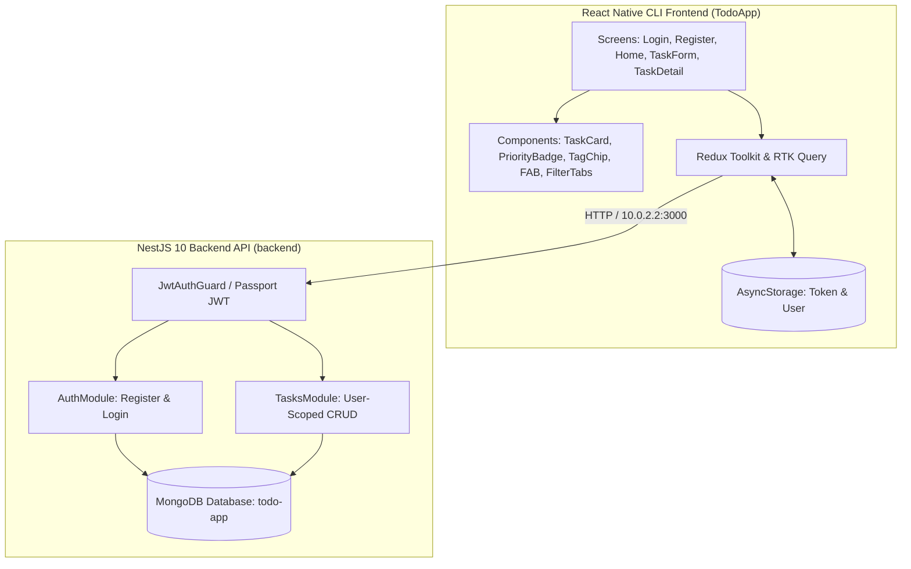

# 🚀 Full Stack React Native To-Do Application

A full stack mobile To-Do application built with **React Native CLI (TypeScript)**, **Redux Toolkit + RTK Query**, and a robust **NestJS 10 + MongoDB** backend. Developed for the Modulus Seventeen Full Stack Developer Assessment.

---

## 🌟 Key Features & Implemented Requirements

### 1. 🔐 User Authentication (JWT)
- **Registration & Login**: Secure account creation and login flow with input validation (`class-validator` on backend, client-side validation on mobile).
- **Password Security**: Passwords hashed with **12 bcrypt salt rounds**; anti-enumeration error handling.
- **Persistent Sessions**: JWT stored in `AsyncStorage` and automatically hydrated on app launch via `RootNavigator`.

### 2. 📋 Task Management (Full CRUD)
- **Task Attributes**: Title, Description, Date-Time, Deadline, Priority (`low`, `medium`, `high`), Category, and Tags.
- **Ownership & Security**: Strict backend multi-tenant scoping — users can only view, edit, or delete their own tasks (403 Forbidden on cross-user access).
- **Interactive Actions**:
  - One-tap status toggle (Complete / Incomplete) with strikethrough animation.
  - Full task deletion with confirmation alert modal.
  - Pull-to-refresh on task list.

### 3. ⭐ Bonus Features Implemented
- **Due Dates & Relative Countdowns**: Calculates humanized deadlines (e.g. *"Due today"*, *"Due in 3d"*, *"Overdue 1d"*) with alert styling for overdue tasks.
- **Composite Priority Urgency Sorting Algorithm**:
  $$\text{Score} = \text{PriorityWeight} + \min\left(10, \frac{10}{\Delta t_{\text{deadline}} + 1}\right) + \min\left(5, \frac{5}{\Delta t_{\text{dateTime}} + 1}\right)$$
  - Ranks overdue and immediate deadline tasks above distant ones, breaking ties deterministically.
- **Categories & Tags**:
  - 6 dedicated categories: `General`, `Work`, `Personal`, `Health`, `Study`, `Shopping`.
  - Custom tag input with `#tag` chip previews.
- **Reactive Status Filters**: Segmented tabs (`All`, `Active`, `Done`) with real-time filtering and custom empty states.
- **Cyberpunk Dark Theme UI**: Custom theme tokens (`#0D0D0D`, `#1A1A2E`, `#E94560`) with `react-native-reanimated` entrance animations, spring transitions, and pulsing Floating Action Button (FAB).

---

## 🏗️ Architecture



---

## 🧪 Comprehensive Automated Test Coverage

The project includes **212 automated unit and integration tests** passing with **100% success rate**:

| Layer | Runner | Test Files | Total Tests | Status |
|---|---|---|---|---|
| **Backend** | Vitest | 6 suites | **21 passed** | ✅ 100% |
| **Frontend** | Jest | 14 suites | **191 passed** | ✅ 100% |
| **Total** | | **20 suites** | **212 passed** | ✅ 100% |

Both codebases compile with strict TypeScript (`tsc --noEmit`) with **0 errors**.

---

## 🚀 Getting Started

### Prerequisites
- Node.js >= 18
- MongoDB running locally on `localhost:27017`
- Android Studio / Android SDK (for running emulator or building APK)

### 1. Backend Setup (`backend/`)
```bash
cd backend
npm install
# Ensure MongoDB service is running (e.g. net start MongoDB)
npm run start:dev
```
Backend API will be running on `http://localhost:3000`.

To run backend tests:
```bash
npm test
```

### 2. Frontend Setup (`TodoApp/`)
```bash
cd TodoApp
npm install
```

Start the Metro Bundler:
```bash
npm start
```

Launch the Android App:
```bash
npm run android
```

To run frontend tests:
```bash
npm test -- --watchAll=false
```

---

## 📱 Pre-Built Android APK
A release/debug APK has been compiled and is ready for direct installation:
- **Location:** `TodoApp/android/app/build/outputs/apk/debug/app-debug.apk`
- **File size:** ~142 MB
- **Cleartext traffic:** Enabled for seamless communication with backend at `http://10.0.2.2:3000` on Android emulator.

---

## 👨‍💻 Author
**VENU GOPAL REDDY PALUGULLA**  
- Email: pvgreddy3@gmail.com  
- LinkedIn: [linkedin.com/in/venugopalreddy0807](https://www.linkedin.com/in/venugopalreddy0807/)  
- Portfolio: [venureddy.vercel.app](https://venureddy.vercel.app/)  
